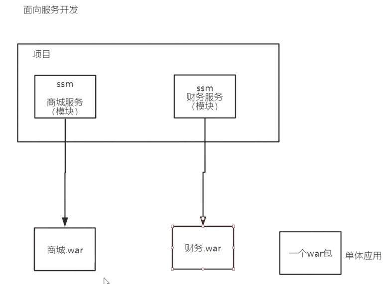
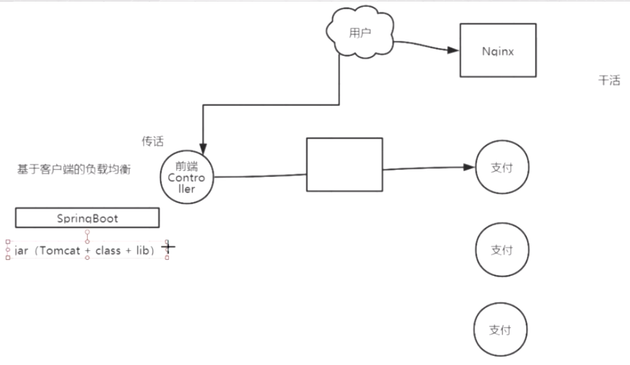

#### Springcloud 

架构师：性能，吞吐量

项目演进：

Springcloud的实现：Neflix、Alibaba、Apache

##### 注册中心：Netflix Eureka

##### 调用服务：Netflix feign(远程服务调用)

​	获取调用结果，直接返回json给前端（前后端分离）或者使用Thymeleaf模板渲染

##### 客户端负载均衡：Netflix  Ribbon

##### 网关：Netflix Zuul 

​	拦截请求，请求转发到不同的controller,权限管理(调用权限系统 spring security ,oauth2.0,shiro,spring session共享或者使用JWT)

##### 分布式事务

Alibaba Seata 开源，Gts产品  协议：TCC

##### 链路追踪

springcloud-sleuth zipkin是对springcloud-sleuth的增强，显示报表

调用的节点比较多，如果出现问题则定位追踪问题

##### 分布式锁

zookeeper Curator,RedLock

##### 熔断降级

​	熔断：当服务出现问题时，下次请求不用调用它，直到服务恢复正常

​	降级：不访问服务，直接给出友好的提示

Netflix Hystrix

##### 节点信息上报

每个节点都需要向admin上报节点状态信息

Actuator

##### 监控中心

spring cloud Admin

整体的监控平台，能看到所有的服务的状态

##### 消息

springcloud Bus(应用层)

spring Messageing 、spring cloud Stream、spring integration、Apache camel

