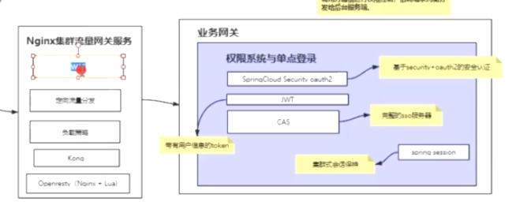
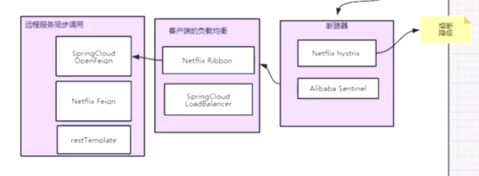
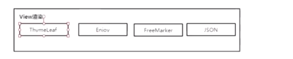

Netflix Eureka 2.0停止维护了

Nacos、zookeeper替代

#### SpringCloud 全家桶 Hoxton SR3



WAF:网络应用防火墙，可以过滤没意义的请求或恶意请求

Nginx:一般支撑1-2万个并发，单机可以支撑的并发量跟cpu、内存的性能关系并不大，可以支撑的并发量跟用户请求产生的带宽有关系

10M的带宽：抗1万个连接，数据包很小的情况下可能

用户的请求：一个请求数据包1M，1万个Qps(吞吐量)，需要1万M的带宽，1万M的网卡，单机不可能跑这么高的带宽；

Kong

LVS+Keepalived :机房内负载均衡器，一个机房就一个机房内负载均衡器

如果机房内负载均衡器不够用，使用多个机房，要保证数据一致性

LVS由DNS来做负载均衡，根据ip请求不同的服务器

机房数据同步：

​	1.机房直连

Tps(有状态的,)，Qps(静态资源)

QPS:峰值时间每秒请求数

TPS:服务器每秒处理的事务数

HttpsDNS:防劫持

##### 域名，二级域名

范域名：*
买个域名：阿里云

webflux:基于netty；

游戏服务器：Netty





热部署：DevTools/jrebel

任务调度：quartz、xxl-job

模块多或者并发高：使用springcloud，否则使用单体应用更好

中台：自助建站系统

#### 搭建Eurake 注册中心

Eurake集群：很容易出现节点信息不一致的现象

作业：搭建Eurake集群

```
使用spring boot1.5.16版本，spring cloud版本选择Edgware.SR4，添加eureka server的依赖

<dependency>
	<groupId>org.springframework.cloud</groupId>
	<artifactId>spring-cloud-starter-eureka-server</artifactId>
</dependency>
在application.properties中设置应用名称

spring.application.name=eureka-server
eureka.instance.appname=eureka-server
还需要开启eureka server之间的相互注册和检索服务

#是否将该实例信息注册到其他eureka server上；如果设置为false，那么该server无法被其他server发现，但是仍然可以发现其他server
eureka.client.register-with-eureka=true
#是否允许该客户端从eureka server上获取注册信息
eureka.client.fetch-registry=true
我们使用主机名来定义注册中心的地址，而不是ip，该配置默认就是false，所以可以不配

eureka.instance.prefer-ip-address=false
我们在同一台机器上创建3个节点的eureka集群，分别是peer1，peer2和peer3

修改hosts文件，使peer1，peer2和peer3都指向127.0.0.1, 具体路径是

C:\Windows\System32\drivers\etc\HOSTS
添加如下内容

127.0.0.1 peer1
127.0.0.1 peer2
127.0.0.1 peer3
然后在项目中创建3个配置文件application-peer1.properties，application-peer2.properties和application-peer3.properties分别作为peer1，peer2和peer3节点的配置文件。配置服务的端口和hostname，指定其他两个eureka server，地址中的hostname应与配置的hostname相对应。

application-peer1.properties

server.port=1111
eureka.instance.hostname=peer1
eureka.client.service-url.defaultZone=http://peer2:1112/eureka/,http://peer3:1113/eureka
application-peer2.properties

server.port=1112
eureka.instance.hostname=peer2
eureka.client.service-url.defaultZone=http://peer1:1111/eureka/,http://peer3:1113/eureka
application-peer3.properties

server.port=1113
eureka.instance.hostname=peer3
eureka.client.service-url.defaultZone=http://peer1:1111/eureka/,http://peer2:1112/eureka
编译后，在target目录下分别执行java -jar eureka-server-1.0.0.jar --spring.profiles.active = peer1，java -jar eureka-server-1.0.0.jar --spring.profiles.active = peer2和java -jar eureka-server-1.0.0.jar --spring.profiles.active = peer3，启动3个eureka server。至此，3节点的eureka搭建完成。

访问 http://localhost:1111 ,在peer1的页面上可以看到，General Info的available-replicas有peer2和peer3节点，说明3个节点的eureka server相互注册成功。如果available-replicas是空的，而unavailable-replicas有其他两个节点，说明配置有问题，集群搭建失败。
```

#### Restful api

第一级别：Http调json

第二级别：引入实体对象或者资源的概念

第三级别：用不同的http的方法调用

第四级别：增加Api版本控制

第五级别：SpringData Rest

