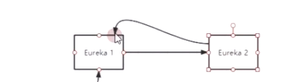
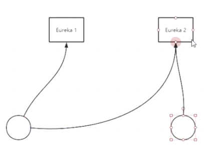
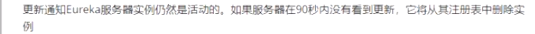
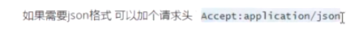
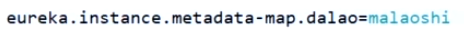

#### Eureka集群

Eureka集群没有主从之分，Eureka集群之间会相互同步数据

集群方式1：多个Eureka相互注册，客户端只需要连一个Eureka就可以获取所有的服务列表

集群方式2：多个Eureka之间是独立的，客户端负责连接多个Eureka,分别获取每个Eureka的服务列表

Eureka容错性：

降低数据一致性

分区容错性：

#### 修改host

添加euk1.com ,euk2.com ,关闭杀毒软件，防火墙

Eureka所有操作调用，全部是基于Restful协议

**hostname**：用来查找主机的

**application.name**:标识分组的

spring.application.name和eureka.instance.appname的作用是一样的

#### unavailable-replicas出现的原因

集群节点的application.name可能不一样，如果application.name相同则说明几个节点是同一组的

Eureka:古希腊语，发现了

Register:服务注册，

Renew:心跳(续租) Eureka客户端需要每30秒发送一次心跳来续租，同时拉取服务列表，90秒没心跳则客户端被剔除

#### Springcloud Hoxton SR3不需要在启动类上加注解（类似@EnableEurekaServer）

serviceId:IP+applicationName+端口

####　Eureka客户端注册和获取服务列表

官方文档：github.com/Netflix/wiki/Eureka-REST-operations

##### Eureka元数据

localhost:7001/eureka/status

Eureka客户端和服务端都可以自定义元数据

自定义元数据信息：在application.yml添加：

##### DiscoveryClient的使用

springcloud提供的接口标准

安全认证

#####  EurekaClilent的使用,使用远程服务调用

status：up表示上线状态

getInstanceId("localhost:provider:80");

getTanstanceByVipAddress("provider",false)；

作业：

​	1.远程服务调用

​	2.使用ribbon完成负载均衡的调用

​	ribbon会把status为down的服务过滤掉

​	LoadBalancerClient

​	3.高可用集群搭建

##### Ribbon

完成客户端的负载均衡，剔除掉状态为down的服务

Eureka:网络不可达，被认为服务不可用，网络可达，但服务挂了Eureka仍然认为服务可用，需要手动把服务状态定义为DOWN

