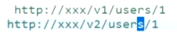
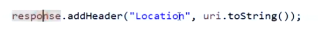

#### Restful风格的API

##### Restful 风格api接口规范

基于http协议的url

1.事先定义资源

用户服务：User

url: /User

http://xxx/User+/getUserList Get

->restful: http://xxx/Users Get 约定

->增加版本 http://xxx/v1/User/getUserList

http://xxx/User/deleteById  Get

->restful: http://xxx/Users/1 Get  请求获取id=1的这个用户，delete请求=删除，put=修改

针对单表，不在重复crud，SpringRest，配置数据源，不用写其他代码

写接口：yapi,swagger

http协议的好处：异构平台（跨语言）(支付接口，微信接口)、可插拔、可用性、状态

#### 远程服务调用 RestTemplate

getForObject:

getForEntity(返回Map,对象)

url使用占位符传参

url使用map传参

postForLocation:资源重定向

缓存：在url后加参数可以避免缓存

##### 拦截器

给RestTemplate加拦截器

#### 声明式服务调用Feign

对RestTemplate对包装，不支持Springmvc注解，openFeign在feign的基础上添加了springmvc注解的支持

@EnableFeignClients

@FeignClient:1.直接写死url调用2.写服务名调用

定义API，Controller

面向接口编程：服务提供方定义api，服务方的controller实现api，api打成jar包，调用方加入api依赖，从FeignClient从api继承；

作业：

getById

#### 负载均衡

服务提供方需要记录客户端连接数

