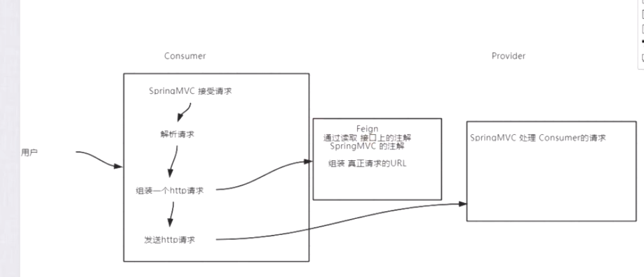
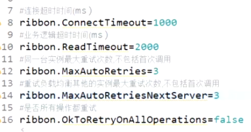
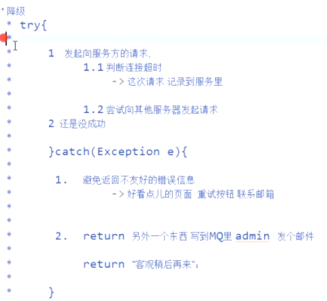
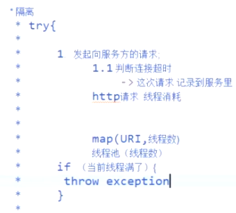

#### Feign常用调用方式

GetMapping,PostMapping,传map，传Person

#### Ribbon的重试策略与服务恢复

设置连接超时时间

设置业务超时时间

同一台实例设置最大重试次数

设置重试其他实例的最大重试次数

#### Hystrix原理

熔断：当一个uri失败次数达到阈值的时候，断路器被开启，后续请求直接返回失败的响应，过一段时间后，断路器会变成半开状态，如果下一个请求成功了，则断路器关闭，否则断路器开启

降级：捕获客户端发送http请求的异常，给友好提示或者其他处理 try-catch

限流：

隔离：hystrix为每个请求都维护了一个线程池，当线程数达到最大线程数，后续请求直接拒绝抛异常

#### Hystrix独立使用

HystrixCommand

#### Hystrix整合RestTemplate

#### Hystrix整合Feign

作业：

feign 远程调用

自己整合RestTemplate,整合feign

限流：谷歌的令牌桶算法，暴力计数器