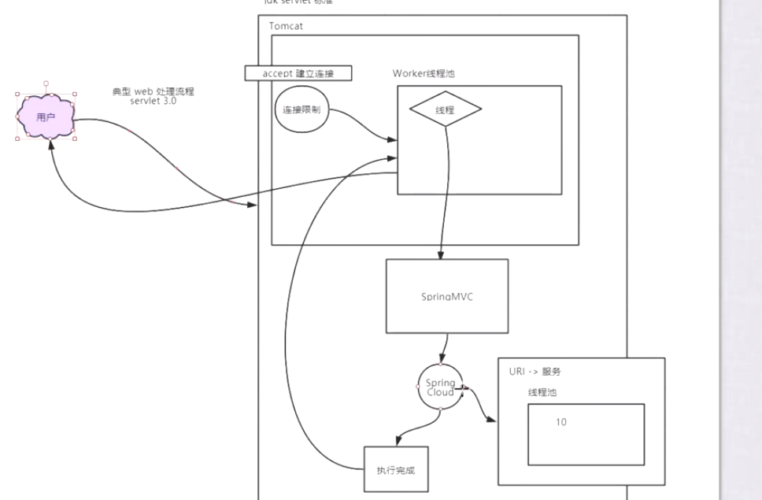
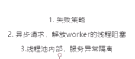

#### feign整合hystrix

1.feign的bug：整合hystrix后，在feign的接口上加@RequestMapping会报错

3.feign配置fallback

3.feign配置fallbackFactory，判断异常类型，给出提示信息

4.RestTemplate整合hystrix,使用@HystrixCommand注解，并提供fallbackMethod,注解不能在controller中直接使用，启动类上需要加@EnableCircuitBreaker或者@EnableHystrix

#### restTemplate整合hsystrix

#### 信号量与线程隔离

####　Hystrix dashboard

#### Hystrix改成信号量隔离

#### 作业

整合feign fallback

zuul配出来

